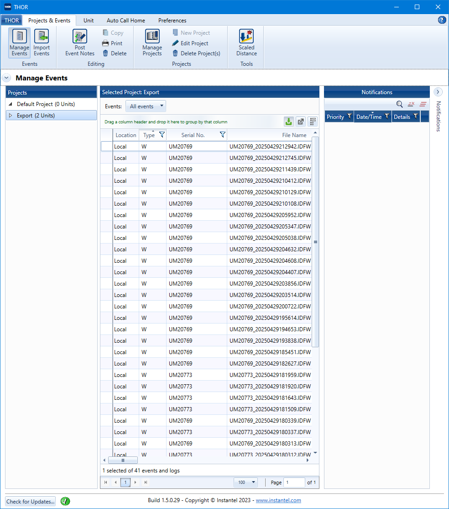
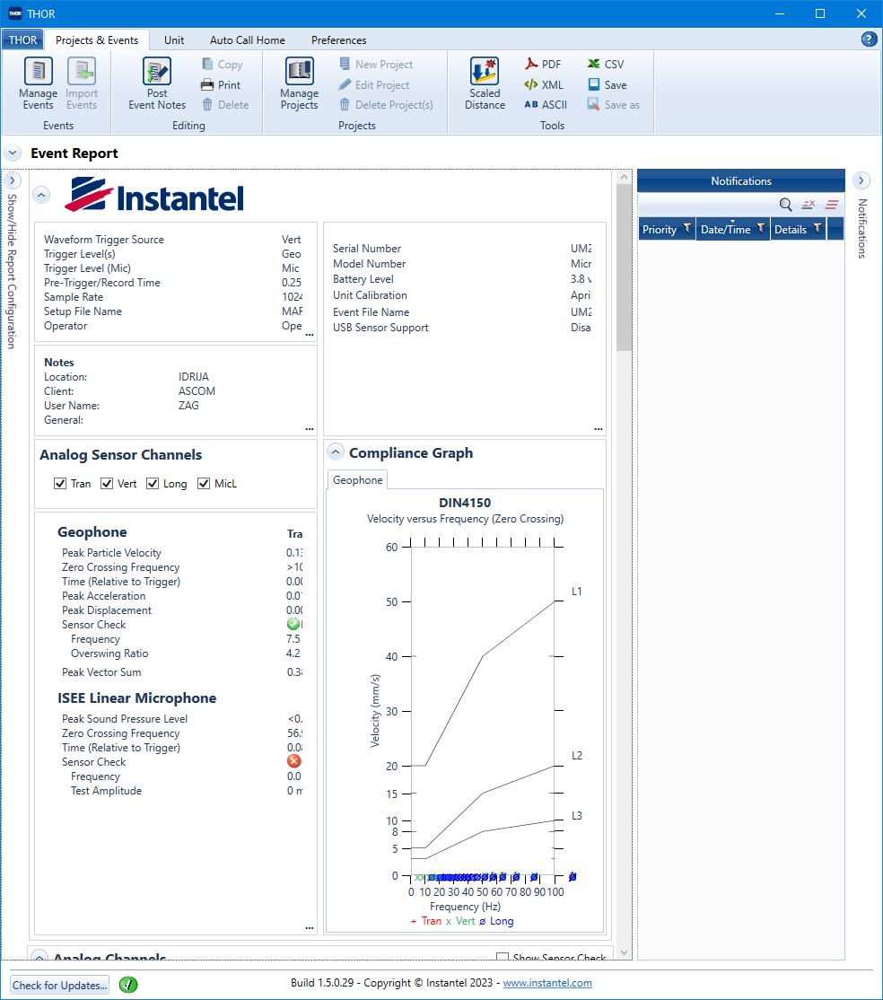
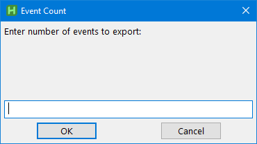

# Jormungandr
- AutoHotkey script to extract Instantel data using THOR software.
- Python script to read the extracted data and produce data `.hdf5`  file and metadata `.json` file.

## Introduction

Our company uses Instantel geophones to capture vibration data. But the THOR software inexplicably does not provide means of extracting all captured data. Thus each data file must be opened in report and manually extracted. Needless to say, having several hundred data files makes this a horribly tedious task.

Thus this script was born. The idea is to fire up THOR, load the desired data info a project then run the provided AutoHotkey script.

### Dependencies

- Obviously the THOR software. This document does *not* attempt to teach the use of this app. Additionally the author has *very* little experience using it, so some things may not be as it it described in this documentation. 
- This script needs [AutoHotkey](https://www.autohotkey.com/) to run. It is a free, open-source scripting language for Windows that allows users to easily create small to complex scripts for all kinds of tasks such as: form fillers, auto-clicking, macros, etc. It needs to be installed and the `*.ahk` extension registered to it. You can check that by double-clicking the `hello_world.ahk` script in this directory. It should display a welcoming message.
- The extracted files are in ASCII format, so you can roll your own parser. You can also use the provided `convert.py` script to read and convert the data into something more accessible. Do do this you will need a relatively modern Python with a few easily available packages.

### Name

The name was taken from the Norse mythology. [Jörmungandr](https://en.wikipedia.org/wiki/J%C3%B6rmungandr) is a fearsome sea serpent. During [Ragnarök](https://en.wikipedia.org/wiki/Ragnarök), Thor and Jörmungandr engage in a ferocious battle, culminating in both of their deaths.

## Using the AutoHotkey script

### Setup data in THOR

The first step is to open the events you wish to export in THOR.

#### Importing data

It's recommended to create a new project, e.g.,  *Export*, to keep the export activities separate from your other projects. Set the project details, e.g., *Measurement Units*, *Compliance Standard*,… to whatever you like.

Now activate the project and use the *import Events* button to import events that you will be exporting.

#### Remove LOG files

The script will barf if you attempt to export a LOG file. So before proceeding, delete all the LOG files from the project (you can use the filter to show just these files for easier deletion)

#### Set the output directory

When exporting, THOR will use the last import directory as the default. If that's ok, nothing further needs to be done. Otherwise:

- Open (double-click) the first event.

- Click the ASCII export button  in the toolbar. This will allow you to choose an output directory and save the exported file there.

- Close the *Event Report* by clicking on the *Manage Events* button

- Once you exported the file you need to either:

  - delete the exported file from disk or
  - delete the event from the list of events,

  otherwise the script will fail, since it does not take into account duplicate files.

#### Setup the windows

In order for the script to work correctly, the main window must look like this:

 Importantly

- The *Export* (or whichever you use) project must be open and the events to be exported must be shown in the list of events.
- The *Manage Events* must not be expanded, as this will mess up the positions of other controls.

When you double-click an event, the resulting window must look like this:

Importantly, the  button must be visible.

The export starts in the main window.

### Running the script

Once you have set the THOR windows, you run the `export.ahk` script by double-clicking it. The script does the following:

- Opens the event report for the event at the top of the list
- Exports the event in the ASCII format
- Closes the event report
- Deletes the event from the event list

This means that, if something goes wrong with the export, you will have the already exported data on the disk, but not in THOR, while the not-yet exported data will be in THOR, meaning it should be easier to continue the export.

#### Number of events

The script cannot determine the number of events in the list, so this is something you will have to provide. On startup the script will show a dialogue, expecting you to enter the number of events to be converted. You can find this number at the bottom of the main screen (41 events in the sample picture above).

This can also be used to test the working of the script by, e.g., entering 1, to process just one event.

Once you have entered the number of events, the script will start running and export all the events into the chosen output directory.
